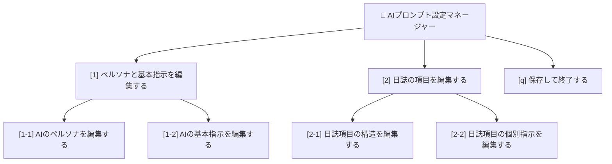

# AI-Assisted Commit & Devlog Generator

このプロジェクトは、AIを活用してGitのコミットメッセージと開発日誌の生成を自動化するための、PowerShellベースのツールです。

## 🚀 特徴

-   **信頼性の高いJSONベースの対話**: AIとの指示・応答を厳密なJSONスキーマで行うため、出力が安定し、信頼性が向上します。
-   **柔軟なカスタマイズ**: AIの役割（ペルソナ）や指示内容、出力形式を、スクリプトを一切変更することなく`scripts/prompt-config.json`ファイルだけで簡単に変更できます。
-   **自動化されたワークフロー**: Gitの差分情報からAIへのプロンプトを自動生成し、コミットと日誌作成までを半自動で実行します。
-   **対話的な操作**: 実行時にステージングされていない変更を自動で追加したり、AIが生成した内容を確認・編集したりできます。

## 🛠️ 使い方

1.  **変更をステージングする**
    ```powershell
    git add .
    ```

2.  **スクリプトを実行する**
    ```powershell
    .\scripts\commit-ai.ps1
    ```

3.  **高レベルの目標を入力する**
    スクリプトに尋ねられたら、今回のコミットが目指す「主な目標」を簡潔に入力します。（例: `READMEの更新とJSON化計画の完了`）

4.  **AIと対話する**
    -   スクリプトがAIへの指示（JSONプロンプト）をクリップボードにコピーします。
    -   お使いのAIチャットインターフェースにプロンプトを貼り付け、実行します。
    -   AIが生成したJSONオブジェクトをクリップボードにコピーします。

5.  **スクリプトを再開する**
    PowerShellのウィンドウに戻り、`Enter`キーを押します。

6.  **確認と実行**
    -   スクリプトがAIの応答をパースし、生成されたコミットメッセージと開発日誌を表示します。
    -   内容を確認し、問題がなければ`y`を入力してコミットとプッシュ（任意）を実行します。
    -   内容を編集したい場合は`e`を入力すると、メッセージの再入力と日誌のメモ帳での編集が可能です。

## 🔧 AIの指示をカスタマイズする方法

AIの振る舞いをコードに触れることなく、安全かつ簡単に対話形式で制御できます。

AIのペルソナ（役割）、タスク指示、日誌の項目などをカスタマイズしたい場合は、以下の管理スクリリプトを実行してください。

```powershell
.\scripts\manage-prompt.ps1
```

このスクリプトは、あなたに質問をしながら、安全に設定ファイル (`scripts/prompt-config.json`) の内容を更新します。JSONファイルを直接編集する必要はなく、構文エラーの心配もありません。

### メニュー構造

スクリプトは、以下の階層メニューで構成されています。



### AIへの指示の全体像

AIへの指示は、以下の3つの階層で構成されています。これを理解することで、AIの応答をより意図通りに制御できます。

| 編集対象 | 目的 | 例えるなら | 編集する時 |
| :--- | :--- | :--- | :--- |
| **ペルソナ** <br/>[1]-[1]) | AIの役割・性格を決める | 役者に「プロのエンジニア」という役を指示する | AIの口調や態度を変えたい時 |
| **基本指示** <br/>([1]-[2]) | AIのタスク・ルールを決める | 役者に「必ずJSON形式で話せ」と指示する | AIの出力形式や行動全体を変えたい時 |
| **個別指示** <br/>([2]-[2]) | 各日誌項目の内容を制御する | 役者に「次のセリフはもっと具体的に」と指示する | 特定の日誌項目の応答内容を具体的に変えたい時 |

### 安全な編集のための仕組み：保護された変数

各「個別指示」には、`{{git_diff}}` や `{{high_level_goal}}` のような、AIが正しく応答するために必須の情報（コンテキスト）が含まれています。

この管理スクリプトは、あなたが誤ってこれらの保護された変数を削除してしまうのを防ぎます。もし必須の変数が含まれていない変更を保存しようとすると、スクリプトがそれを検知し、変更を自動的に破棄して、元の安全な状態から編集をやり直せるように促します。これにより、安心して指示内容のチューニングに集中できます。

### 具体的な使い方：AIの応答をより良くする

**例：「課題・次にやること」のAIの応答を、もっと具体的にしたい場合**

1.  `.\scripts\manage-prompt.ps1` を実行します。
2.  メインメニューで `[2]` (日誌の項目を編集する) を選択します。
3.  サブメニューで `[2]` (日誌項目の個別指示を編集する) を選択します。
4.  表示されたリストから `[5] ❗ 課題・次にやること (issues_or_next)` の番号 `5` を入力します。
5.  メモ帳が開くので、指示文をより具体的に書き換えます。
    > **変更前:**
    > このコミットを受けて、次に取り組むべき具体的な課題やタスクを提案してください。特に、ユーザーが入力した {{high_level_goal}} を達成するために何が必要かを強く意識してください。
    >
    > **変更後:**
    > このコミットを受けて、次に取り組むべき具体的な課題やタスクを、**ファイル名や修正すべき関数名を挙げて3つ**提案してください。特に、ユーザーが入力した {{high_level_goal}} を達成するために何が必要かを強く意識してください。
6.  編集後、メモ帳を上書き保存して閉じます。
7.  スクリプトが「✅ 個別指示を更新しました。」と表示すれば成功です。
8.  `q` でスクリプトを終了すれば、次回の `commit-ai.ps1` 実行時からAIの応答がより具体的になります。
