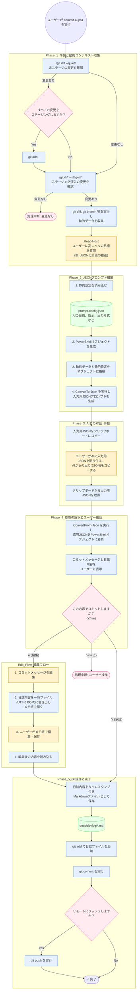

```mermaid
graph TD
    %% --- スタイル定義 ---
    classDef userAction fill:#fff2cc,stroke:#d6b656,stroke-width:2px;
    classDef scriptAction fill:#e6f0ff,stroke:#5691d6,stroke-width:1px;
    classDef fileIO fill:#e6ffe6,stroke:#56d656,stroke-width:1px;
    classDef decision fill:#ffebf0,stroke:#d65691,stroke-width:1px;
    classDef aiInteraction fill:#f0e6ff,stroke:#9156d6,stroke-width:2px;

    %% --- フロー開始 ---
    Start((ユーザーが commit-ai.ps1 を実行)) --> CheckUnstaged;

    %% --- フェーズ1: 準備段階 ---
    subgraph Phase_1_準備と動的コンテキスト収集
        CheckUnstaged["/git diff --quiet/\n未ステージの変更を確認"]:::scriptAction;
        CheckUnstaged -- "変更あり" --> AskStage{"すべての変更を\nステージングしますか？"}:::decision;
        AskStage -- "Yes" --> GitAddAll["git add ."]:::scriptAction;
        AskStage -- "No" --> CheckStaged;
        CheckUnstaged -- "変更なし" --> CheckStaged;
        GitAddAll --> CheckStaged;

        CheckStaged["/git diff --staged/\nステージング済みの変更を確認"]:::scriptAction;
        CheckStaged -- "変更なし" --> End_NoChanges([処理中断: 変更なし]):::decision;
        CheckStaged -- "変更あり" --> GatherContext;

        GatherContext["git diff, git branch 等を実行し\n動的データを収集"]:::scriptAction;
        GatherContext --> AskHighLevelGoal;

        AskHighLevelGoal["Read-Host\nユーザーに高レベルの目標を質問\n(例: JSON化計画の推進)"]:::userAction;
    end
    AskHighLevelGoal --> AssemblePrompt;

    %% --- フェーズ2: プロンプト構築 (役割分担の核心) ---
    subgraph Phase_2_JSONプロンプト構築
        AssemblePrompt["1. 静的設定を読み込む"]:::scriptAction;
        AssemblePrompt --> ReadConfigFile;
        ReadConfigFile[("prompt-config.json\nAIの役割、指示、出力形式など")]:::fileIO;

        ReadConfigFile --> CreatePSObject;
        CreatePSObject["2. PowerShellオブジェクトを生成"]:::scriptAction;
        CreatePSObject --> PopulateObject;
        PopulateObject["3. 動的データと静的設定を\nオブジェクトに格納"]:::scriptAction;
        PopulateObject --> ConvertToJson;
        ConvertToJson["4. ConvertTo-Json を実行し\n入力用JSONプロンプトを生成"]:::scriptAction;
    end
    ConvertToJson --> ToClipboard;

    %% --- フェーズ3: AIとの対話 ---
    subgraph Phase_3_AIとの対話_手動
        ToClipboard["入力用JSONをクリップボードにコピー"]:::scriptAction;
        ToClipboard --> UserPastePrompt["ユーザーがAIに入力用JSONを貼り付け、\nAIからの出力(JSON)をコピーする"]:::userAction;
        UserPastePrompt --> FromClipboard;
        FromClipboard["クリップボードから出力用JSONを取得"]:::scriptAction;
    end
    FromClipboard --> ParseResponse;

    %% --- フェーズ4: 応答の解釈と検証 ---
    subgraph Phase_4_応答の解釈とユーザー確認
        ParseResponse["ConvertFrom-Json を実行し\n応答JSONをPowerShellオブジェクトに変換"]:::scriptAction;
        ParseResponse --> DisplayToUser;
        DisplayToUser["コミットメッセージと日誌内容を\nユーザーに表示"]:::scriptAction;
        DisplayToUser --> AskConfirm{"この内容でコミットしますか？\n(Y/n/e)"}:::decision;
    end
    AskConfirm -- "e (編集)" --> EditFlow;
    AskConfirm -- "n (中止)" --> End_UserCancel([処理中断: ユーザー操作]):::decision;
    AskConfirm -- "Y (承認)" --> SaveLog;

    %% --- 編集フロー ---
    subgraph Edit_Flow_編集フロー
        EditFlow["1. コミットメッセージを編集"]:::userAction;
        EditFlow --> OpenNotepad["2. 日誌内容を一時ファイル\n(UTF-8 BOM)に書き出し\nメモ帳で開く"]:::scriptAction;
        OpenNotepad --> UserEditFile["3. ユーザーがメモ帳で編集・保存"]:::userAction;
        UserEditFile --> ReadTempFile["4. 編集後の内容を読み込む"]:::scriptAction;
    end
    ReadTempFile --> SaveLog;

    %% --- フェーズ5: 最終処理 ---
    subgraph Phase_5_Git操作と完了
        SaveLog["日誌内容をタイムスタンプ付き\nMarkdownファイルとして保存"]:::scriptAction;
        SaveLog --> AddLogFile[("docs/devlog/*.md")]:::fileIO;
        AddLogFile --> GitAddLog["git add で日誌ファイルを追加"]:::scriptAction;
        GitAddLog --> GitCommit["git commit を実行"]:::scriptAction;
        GitCommit --> AskPush{"リモートにプッシュしますか？"}:::decision;
        AskPush -- "Yes" --> GitPush["git push を実行"]:::scriptAction;
        AskPush -- "No" --> End_Success;
        GitPush --> End_Success;
    end
    End_Success([✅ 完了])
```

