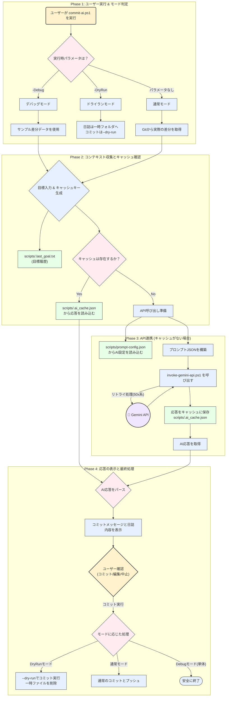
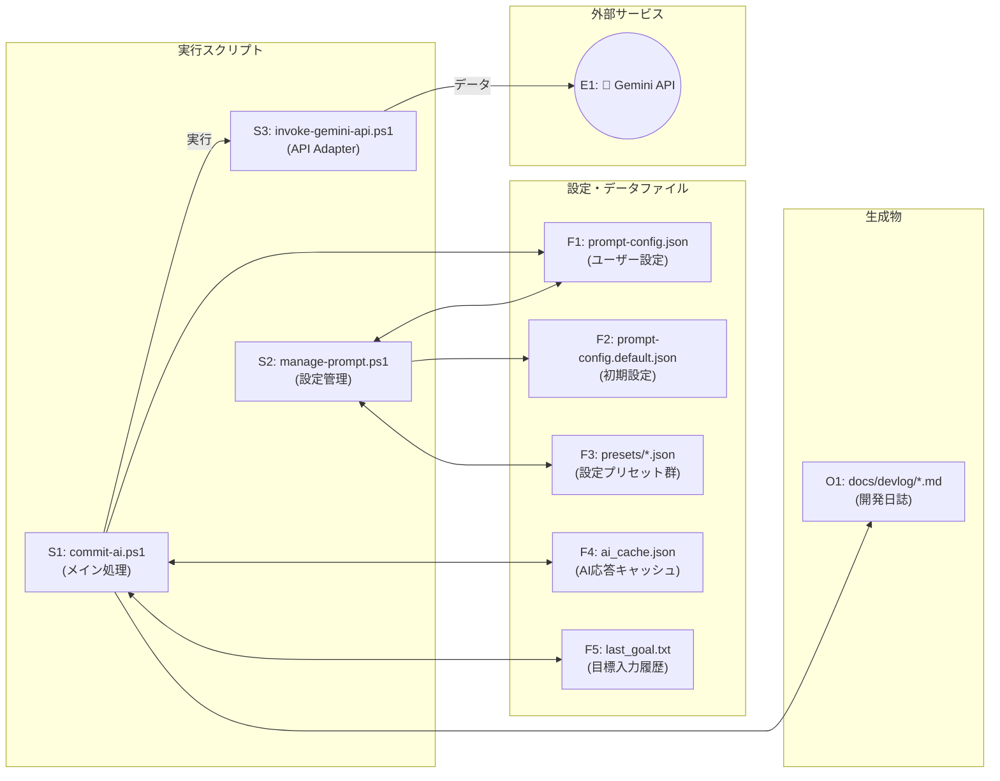
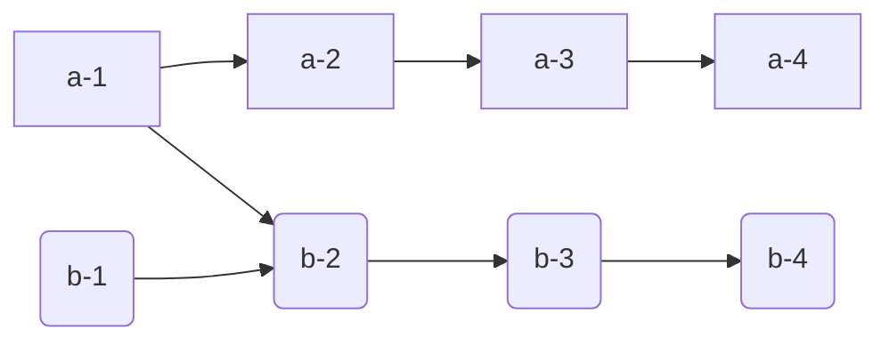

## プロジェクト構成と処理フロー

このドキュメントは、AIコミット＆日誌生成ツールの全ファイルの役割と、それらがどのように連携して動作するかを解説します。

### ■ 主要ファイルとフォルダの役割

| ファイル/フォルダ | 役割 |
| :--- | :--- |
| **`scripts/commit-ai.ps1`** | **メインスクリプト。** ユーザーが実行する中心的なファイル。Git情報の収集、AI応答のキャッシュ確認、API呼び出しの指示、最終的なコミットまで、全体の処理フローを制御します。 |
| **`scripts/manage-prompt.ps1`** | **設定管理スクリプト。** 対話形式で`prompt-config.json`の内容を安全に編集します。お気に入りの設定を「プリセット」として保存・読込する機能も持ちます。 |
| **`scripts/api_adapters/`** | **API連携スクリプト群。** `invoke-gemini-api.ps1`などがここに配置されます。メインスクリプトから渡されたプロンプトを、各AIサービス（Geminiなど）が要求する形式に整形し、実際にAPI通信を行う責務を担います。 |
| `scripts/prompt-config.json` | **ユーザー設定ファイル。** AIのペルソナやタスク指示など、ユーザーが自由にカスタマイズする設定が保存されます。このファイルは`.gitignore`で管理対象外とすべきです。 |
| `scripts/prompt-config.default.json` | **初期設定ファイル。** `prompt-config.json`が存在しない場合にコピーされたり、設定を初期状態に戻したりする際のテンプレートとなります。 |
| **`scripts/presets/`** | **プリセット保存フォルダ。** `manage-prompt.ps1`で保存した、ユーザー独自の設定プリセット（`.json`形式）が格納されます。このフォルダも`.gitignore`で管理対象外とするのが適切です。 |
| `scripts/.last_goal.txt` | **履歴ファイル。** `commit-ai.ps1`で前回入力された「主な目標」を一時的に保存します。 |
| `scripts/.ai_cache.json` | **キャッシュファイル。** 一度APIから取得したAIの応答を保存します。「同じ差分」と「同じ目標」の組み合わせの場合は、APIを呼び出さず、このキャッシュを再利用してトークン消費を節約します。 |
| **`docs/devlog/`** | **開発日誌出力先。** AIが生成した日誌がMarkdownファイルとして保存されます。プロジェクトの成果物であり、ツール自体のソースコードとは分けるため、`.gitignore`で管理対象外とすることが推奨されます。 |

### ■ 全体処理フロー図

---
### ■ 全体処理フロー図

