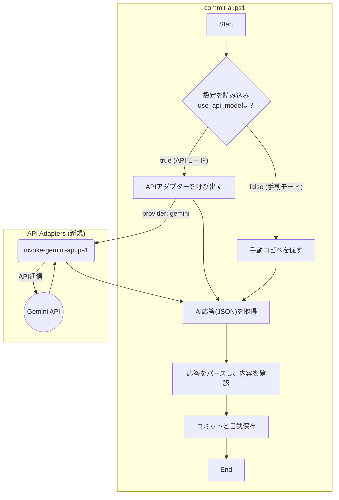

# 計画書：API自動実行モードの導入

## 1. 目的

-   **手動操作の完全撤廃:** `commit-ai.ps1` 実行時の、AIとのプロンプトのコピー＆ペースト作業を完全に自動化する。
-   **開発体験の向上:** スクリプト実行からコミット完了までを、対話式の入力のみでシームレスに完結させる。
-   **柔軟性の確保:** ユーザーが従来の手動モードと新しいAPI自動モードを、設定ファイルで簡単に切り替えられるようにする。

## 2. 全体像（アーキテクチャ）

`commit-ai.ps1` の実行フローを、設定に応じて分岐させます。APIごとの仕様の違いは、新しく導入する「APIアダプター」が吸収し、本体のロジックはクリーンに保ちます。

## 3. 主な変更点
### 3.1. 設定ファイル (`prompt-config.json`) の拡張
APIモードの制御と設定情報を追加します。

| キー | 型 | 説明 | 例 |
| :--- | :--- | :--- | :--- |
| `use_api_mode` | boolean | `true`でAPIモード、`false`で手動モード。 | `true` |
| `api_provider` | string | 使用するAPIプロバイダーを指定。 | `"gemini"` |
| `api_key_env` | string | APIキーを読み込む環境変数名。 | `"GEMINI_API_KEY"` |
| `api_endpoints` | object | 各プロバイダーのAPI情報を格納。 | `{ "gemini": { ... } }` |

### 3.2. 新規ファイル：APIアダプターの導入
APIごとの差異を吸収する「翻訳者」の役割を担うスクリプトを、新しいディレクトリに配置します。

-   **新規ディレクトリ:** `scripts/api_adapters/`
-   **新規ファイル:** `scripts/api_adapters/invoke-gemini-api.ps1`
-   **責務:**
    -   `commit-ai.ps1` から汎用的なプロンプトデータを受け取る。
    -   環境変数 (`GEMINI_API_KEY`) からAPIキーを読み込む。
    -   受け取ったデータを、Gemini APIが要求するJSON形式に整形する。
    -   `Invoke-RestMethod` コマンドでGemini APIを呼び出す。
    -   APIからの応答をパースし、必要な部分だけを抽出して `commit-ai.ps1` に返す。

### 3.3. `commit-ai.ps1` の改修
-   起動時に `prompt-config.json` の `use_api_mode` をチェックします。
-   `true` の場合は、`api_provider` の設定に応じて適切なAPIアダプタースクリプトを呼び出し、その結果を待ちます。
-   `false` の場合は、従来通りの手動コピー＆ペーストのフローを実行します。
-   どちらのフローから得られた応答も、その後のパース処理、確認・編集処理は共通のロジックで扱います。

### 3.4. `manage-prompt.ps1` の改修
-   API関連の設定を安全に編集できるよう、メインメニューに `[3] API設定を編集する` のような新しい項目を追加します。
-   このメニューから、`use_api_mode` の切り替えや、`api_provider` の選択ができるようにします。

## 4. 今後の拡張性
この設計により、将来的にOpenAI (ChatGPT) やAnthropic (Claude) などの新しいAIに対応する際、`commit-ai.ps1` 本体を修正する必要はなくなります。

1.  `scripts/api_adapters/` に `invoke-openai-api.ps1` のような新しいアダプターを追加する。
2.  `prompt-config.json` の `api_endpoints` にOpenAI用の設定を追加する。
3.  `manage-prompt.ps1` で `api_provider` を `"openai"` に切り替える。

これだけで、新しいAIへの切り替えが可能になります。

以上の計画について、ご承認いただけましたら、具体的なスクリプトの実装に着手します。

<!--
[PROMPT_SUGGESTION]この計画を承認する。スクリプトの変更を開始せよ。[/PROMPT_SUGGESTION]
[PROMPT_SUGGESTION]APIアダプターの具体的な処理内容について、さらに詳しく説明してください。[/PROMPT_SUGGESTION]
-->
