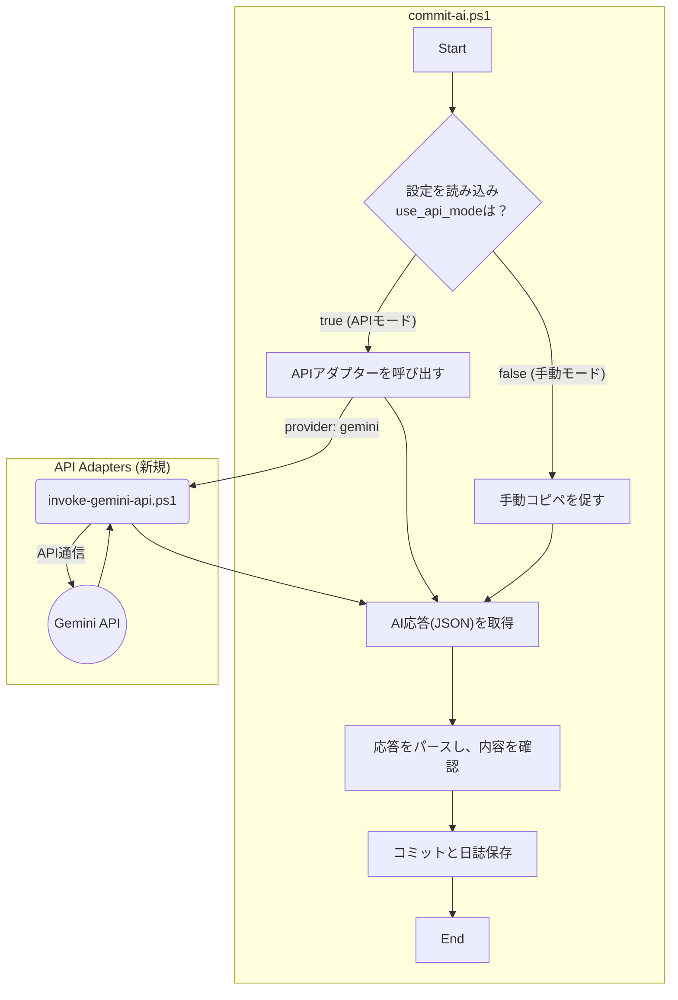
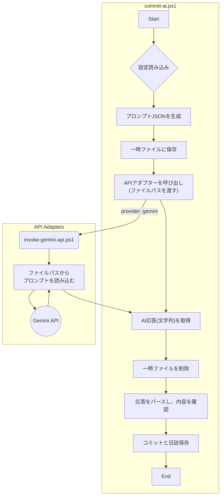

# 計画書：API自動実行モード（改訂版）

## 1. 目的

-   **手動操作の完全撤廃:** `commit-ai.ps1` 実行時の、AIとのプロンプトのコピー＆ペースト作業を完全に自動化する。
-   **開発体験の向上:** スクリプト実行からコミット完了までを、対話式の入力のみでシームレスに完結させる。
-   **柔軟性の確保:** ユーザーがAPIモードと手動モード、さらには日誌の言語などを設定ファイルで簡単に切り替えられるようにする。

## 2. 全体像（アーキテクチャ）

PowerShellパーサーの脆弱性を完全に回避するため、スクリプト間のデータ受け渡しは**一時ファイルを経由する方式**を正式に採用する。これにより、プロンプトの長さや内容に依存しない、極めて安定した動作を実現する。

## 3. 主な変更点

### 3.1. 設定ファイル (`prompt-config.json`) の拡張

APIモードの制御に加え、日誌の言語を指定する項目を追加する。

| キー | 型 | 説明 | デフォルト値 |
| :--- | :--- | :--- | :--- |
| `use_api_mode` | boolean | `true`でAPIモード、`false`で手動モード。 | `true` |
| `api_provider` | string | 使用するAPIプロバイダーを指定。 | `"gemini"` |
| `api_key_env` | string | APIキーを読み込む環境変数名。 | `"GEMINI_API_KEY"` |
| `devlog_language`| string | 開発日誌の出力言語を指定 (`japanese` または `english`)。 | `"japanese"` |
| `api_endpoints` | object | 各プロバイダーのAPI情報を格納。 | `{...}` |

### 3.2. APIアダプター (`invoke-gemini-api.ps1`) の責務

-   `commit-ai.ps1` から**一時ファイルのパス**と設定オブジェクトを受け取る。
-   ファイルパスからプロンプトJSONを読み込む。
-   環境変数からAPIキーを読み込む。
-   受け取ったデータと設定を元に、Gemini APIが要求するJSON形式のボディを構築する。
-   `Invoke-RestMethod` コマンドでGemini APIを呼び出す。
-   APIからの応答（JSON文字列）を`commit-ai.ps1`に返す。

### 3.3. `commit-ai.ps1` の改修

-   **プロンプト受け渡し:** 生成したAIプロンプトを一時ファイルに保存し、そのパスをAPIアダプターに渡す方式に変更する。
-   **日誌生成ロジックの復活:**
    -   AIの応答をパースした後、`prompt-config.json`のスキーマ定義と絵文字アイコン（例: `✅`, `📚`）を元に、Markdown形式の日誌を動的に再構築するロジックを復活させる。
    -   参考とする日誌のフォーマットは `docs/devlog/2025-07-02-203009.md` とする。
-   **多言語対応:**
    -   `prompt-config.json` の `devlog_language` 設定を読み込む。
    -   AIへの指示（`task_instruction`）に、「日誌は必ず指定された言語（例: Japanese）で記述すること」という一文を動的に追加する。

## 4. 開発日誌の管理方針（改訂）

-   **基本方針:** このツールは、**あらゆるGitプロジェクトで汎用的に利用されること**を目的とする。したがって、生成される開発日誌は、このツール自体のリポジトリではなく、**利用先の各プロジェクトに帰属する**ものと定義する。
-   **具体的な実装:**
    -   このツール（`ai-commit-sandbox`）のリポジトリのルートに `.gitignore` ファイルを設置する。
    -   `.gitignore` に `docs/devlog/` を追加する。
-   **効果:**
    -   このツール自体の開発時に生成されるテスト用の日誌が、誤ってGitの管理対象になることを防ぐ。
    -   ユーザーが他のプロジェクトでこのツールを利用した際に生成される日誌は、そのプロジェクトのGit管理下に置かれ、このツールリポジトリには影響を与えない。これにより、ツールの独立性と汎用性を担保する。
