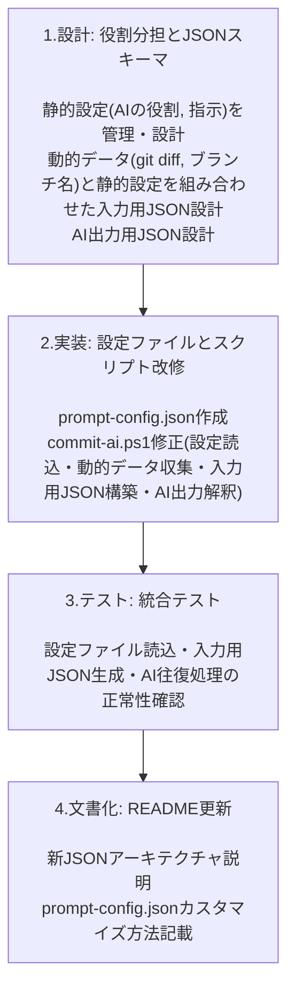

ai-commit プロジェクト JSON化計画 (改訂版)
1. 目的 (Why)
現在のスクリプトは、AIとのやり取りを巨大な文字列で行っており、AIの解釈の揺れやコンテキスト不足によって、出力の信頼性（特に「課題・次にやること」項目）が低いという問題を抱えています。この計画の目的は、AIとのインターフェースを構造化されたJSONデータに移行することで、以下の価値を実現することです。

信頼性の向上: AIへの「指示」「コンテキストデータ」「高レベルの目標」を明確に分離したJSONで入力し、AIからの応答も厳密なJSONで受け取ることで、プロンプトの誤解釈を防ぎ、常に期待通りのフォーマットと品質でコミットメッセージと日誌を得られるようにします。

保守性と拡張性の確保: プロンプトの変更が、巨大な文字列の修正から、オブジェクトのプロパティを追加・変更するだけの簡単な作業になります。将来的に「テスト結果」や「関連チケット番号」といった新しいコンテキストを追加したり、出力項目を増やしたりすることが、安全かつ容易になります。

2. 方法論 (How)
AIとの「入力（プロンプト）」と「出力（応答）」を相補的にJSON化します。

入力プロンプトのJSON化: git diffなどの技術的コンテキストに加え、**ユーザーが意図する高レベルの目標（例：「JSON化計画の推進」）**もJSONオブジェクトに含めて構築します。これにより、AIは単なるコードの差分だけでなく、その変更が持つ意味を理解できるようになります。

PowerShell (commit-ai.ps1): Read-Hostでユーザーから高レベルの目標を任意で受け取り、[PSCustomObject]でオブジェクトを構築後、ConvertTo-JsonでJSON文字列に変換します。
出力応答のJSON化: AIからの応答を、単純なテキストではなく、定義されたスキーマを持つJSON形式で受け取ります。これにより、---LOG_SEPARATOR---のような不安定な区切り文字への依存を完全に排除します。

PowerShell (commit-ai.ps1): ConvertFrom-Jsonコマンドレットを使い、受け取ったJSON文字列をネイティブのPowerShellオブジェクトに変換して、安全に各プロパティにアクセスします。
3. 計画フローチャート (What Steps)
以下のステップで、計画的かつ安全に移行作業を進めます。

mermaid
 Show full code block 
graph TD
    A[1. 設計: JSONスキーマ定義] --> B;
    B[2. 実装: commit-ai.ps1 の修正] --> C;
    C[3. テスト: PowerShell版の動作確認] --> F;

    subgraph 設計フェーズ
        A("
            <b>1. 設計: JSONスキーマ定義</b> 
            - AIへの入力(コンテキスト + <b>高レベル目標</b>)と 
            - AIからの出力(コミット + 日誌)の 
            両方のJSON構造を決定する
        ");
    end

    subgraph PowerShell実装フェーズ
        B("
            <b>2. 実装: commit-ai.ps1 の修正</b> 
            - 入力: <b>Read-Hostで目標を取得</b>し、`ConvertTo-Json`に置換 
            - 出力: 文字列分割を`ConvertFrom-Json`に置換
        ");
        C("
            <b>3. テスト: PowerShell版の動作確認</b> 
            - 生成されるJSONプロンプトの正当性を確認 
            - AIとの往復処理全体をテスト
        ");
    end

    subgraph 最終化フェーズ
        F("
            <b>4. 文書化: README更新</b> 
            - 新しいJSONベースのI/Oについて説明 
            - プロンプトのカスタマイズ方法を更新 
            - スクリプトの保守性と拡張性をアピール
        ");
    end
(注: 開発リソースをPowerShellに集中させるため、フローチャートからBash版の実装を除外しました。)

結論：スクリプトと設定ファイルの「役割分担」が最適解です
あなたの質問の核心は、「AIへの指示をどこで管理すべきか？」です。これに対する最善の答えは、「スクリプト」と「設定ファイル」で役割を分担させることです。

スクリプト (commit-ai.ps1) の役割

動的なデータの収集: git diff の取得やブランチ名の確認など、実行するたびに内容が変わる「動的なデータ」を集めることに専念します。
プロセスの実行: データを集め、設定ファイルを読み込み、AIと通信し、最終的にgit commitを実行するという、一連の「処理」を担当します。
設定ファイル (例: prompt.json) の役割

静的な設定の管理: AIへの基本的な指示（「あなたはエンジニアです」など）や、出力してほしいJSONの形式、日誌の各項目のタイトル（「✅ やったこと」など）といった、めったに変わらない「静的な設定」を保持します。
柔軟性の提供: あなたがAIへの指示を微調整したいと思ったとき、スクリプトのコードを一切触ることなく、この設定ファイルだけを書き換えれば済むようになります。
この「役割分担」こそが、あなたが求めている「AIに渡すコンテキストを我々が制御できる」状態を実現する、最もクリーンで保守性の高い方法です。

設計のタイミング：JSON化の「最初のステップ」として今すぐ行うべき
では、この「役割分担」の設計をいつ行うべきか？

答えは明確に「今すぐ」です。

これは、家を建てる前の「設計図」を描く作業に相当します。設計図なしに実装（JSON化）を始めてしまうと、後から「やっぱり柱の位置を変えたい」となった時に、大規模な手戻りが発生してしまいます。

JSON化計画は、まさにこの「役割分担」を定義することから始めるべきです。JSONの構造（スキーマ）を考えることは、すなわちスクリプトと設定ファイルの役割分担を具体的に設計することと同義なのです。

まとめ：整理された新しいワークフロー
あなたの質問のおかげで、計画はより明確になりました。今後のワークフローは以下のようになります。

【設計】(今やるべきこと)

AIへの入力用JSONと、AIからの出力用JSONの具体的な形（スキーマ）を定義します。
この時、入力用JSONの中に、スクリプトが埋める「動的データ」の場所と、設定ファイルから読み込む「静的データ」の場所を明確に区別します。
【実装】(設計の後)

commit-ai.ps1を修正し、この新しい設計図に従って動作するようにします。
gitから動的データを取得する。
prompt.jsonのような設定ファイルを読み込む。
両者を合体させて、最終的な「入力用JSON」を完成させる。
AIからの「出力用JSON」を正しく解釈して、コミットと日誌を作成する。
あなたの質問は、計画の曖昧だった部分を洗い出し、プロジェクトを正しい方向に導くための極めて重要なものでした。この整理された方針に基づき、JSON化計画を自信を持って進めることができます。

