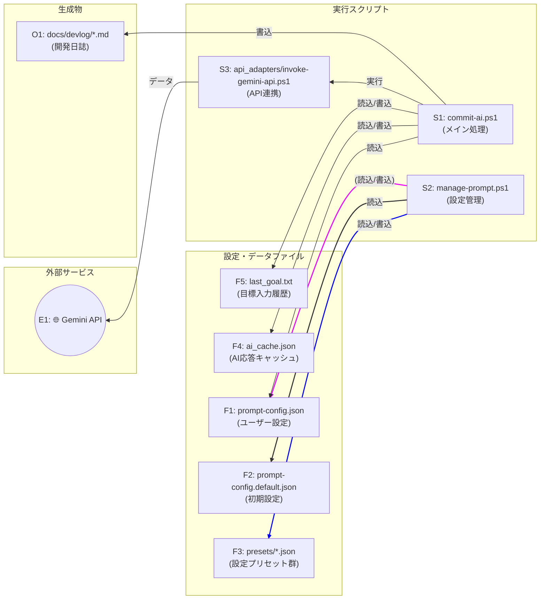

### ■ 全体処理フロー図 (線の色を変えないとわかりづらい)

```mermaid
graph RL
    subgraph "生成物"
        direction TB
        O1["O1: docs/devlog/*.md<br>(開発日誌)"];
    end

    subgraph "設定・データファイル"
        direction TB
        F1["F1: prompt-config.json<br>(ユーザー設定)"];
        F2["F2: prompt-config.default.json<br>(初期設定)"];
        F3["F3: presets/*.json<br>(設定プリセット群)"];
        F4["F4: ai_cache.json<br>(AI応答キャッシュ)"];
        F5["F5: last_goal.txt<br>(目標入力履歴)"];
    end
    
    subgraph "実行スクリプト"
        direction TB
        S1["S1: commit-ai.ps1<br>(メイン処理)"];
        S2["S2: manage-prompt.ps1<br>(設定管理)"];
        S3["S3: api_adapters/invoke-gemini-api.ps1<br>(API連携)"];
    end

    subgraph "外部サービス"
        direction TB
        E1(("E1: 🌐 Gemini API"));
    end

    F1 ~~~ O1;
    S1 ~~~ F1;

    S2 -- "読込/書込" --> F3;
    linkStyle 2 stroke:#0000FF,stroke-width:2px
    S2 -- "読込" --> F2;
    linkStyle 3 stroke:#000FF,stroke-width:2px
    S2 -- "(読込/書込)" --> F1;
    linkStyle 4 stroke:#F000FF,stroke-width:2px


    S1 -- "読込" --> F1;
    S1 -- "読込/書込" --> F4;
    S1 -- "読込/書込" --> F5;
    S1 -- "実行" --> S3;
    S1 -- "書込" --> O1;

    S3 -- "データ" --> E1;

    classDef userAction fill:#fff2cc,stroke:#333,stroke-width:2px,color:#333;
    classDef scriptAction fill:#e6f0ff,stroke:#333,stroke-width:1px,color:#333;
    classDef fileIO fill:#e6ffe6,stroke:#333,stroke-width:1px,color:#333;
    classDef decision fill:#ffebf0,stroke:#333,stroke-width:1px,color:#333;
    classDef api fill:#f0e6ff,stroke:#333,stroke-width:2px,color:#333;

    class A,V userAction;
    class B,K,W,T decision;
    class C,D,E,F,G,H,I,M,O,P,S,U,X,Y,Z scriptAction;
    class J,L,N,R fileIO;
    class Q api;
```